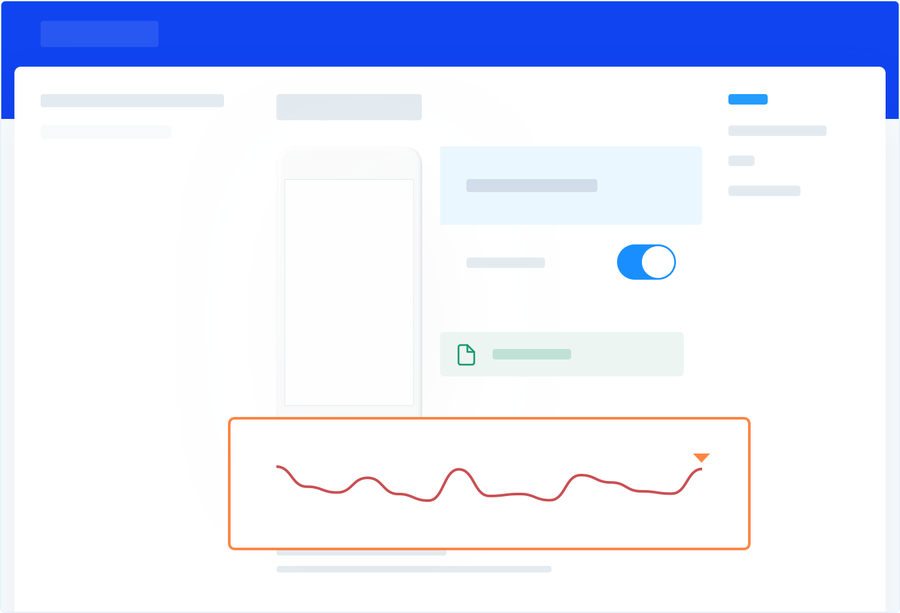

Just like before an airplane crash, Shake records a detailed environment 
profile covering the last 60 seconds before a bug was submitted.

## Introduction
Black box includes device and app data, like memory load and connectivity status.
You'll find the charts right below the screenshot.



## Data
### Device memory usage
This line chart shows the device's total memory usage. 
When you hover over the chart, the usage percentage, 
as well as the exact memory usage over the total amount of memory available, 
is shown, for example: 9% • 224 out of 2464 MB.

Device memory usage is captured every 0.5 seconds.

### App memory usage
This line chart shows your app's memory usage. When you hover over the chart, 
the total memory usage of your app is shown, for example: 122 MB.

Your app's memory usage is captured every 0.5 seconds.

### Network
This chart shows the connectivity details of the device. 
When you hover over the chart, connectivity details are shown such as WiFi name, 
cellular connectivity type (GPRS, Edge, 3G, LTE or CDMA) and "Offline" if there was no network connectivity.

Examples:
* WiFi • Office_Network_Name
* Cellular 3G
* Offline

Device connectivity details are captured every 2 seconds.

### Device Orientation
This chart shows the orientation state of your app, such as whether the app is in portrait or landscape mode. 
When you hover over the chart, the exact state is shown.

App orientation is captured every 2 seconds.

## Enabling and disabling
Black box is enabled by default, however, you can use the method below to disable it.

import Tabs from '@theme/Tabs';
import TabItem from '@theme/TabItem';

<Tabs
  groupId="android"
  defaultValue="kotlin"
  values={[
    { label: 'Java', value: 'java'},
    { label: 'Kotlin', value: 'kotlin'},
  ]
}>

<TabItem value="java">

```java title="App.java"
Shake.getReportConfiguration().setEnableBlackBox(false);
```

</TabItem>

<TabItem value="kotlin">

```kotlin title="App.kt"
Shake.getReportConfiguration().isEnableBlackBox = false
```

</TabItem>
</Tabs>
