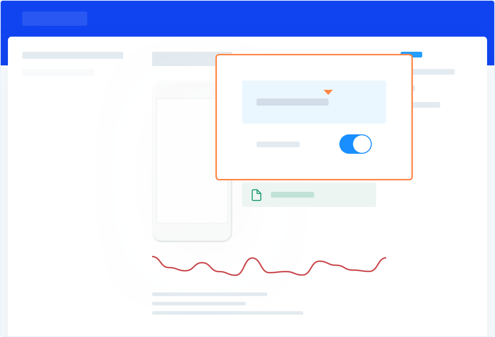

---
id: permissions
title: Permissions
---
This page covers how Shake reports to you on the status of a user's permissions listed below.

## Introduction
Shake precisely lists permissions that a user has explicitly granted access to.
The ones you don't see listed in a report were either denied or not requested at all.

You can review user granted permissions on the Dashboard.

## Tracking useful permissions on iOS
The Shake SDK tracks the status of these  iOS permissions, and reports to 
you whether a user has or hasn't granted your app access to them:

* Calendar access
* Camera access
* Contacts access
* Photo library access
* Location access
* Media library access
* Microphone access

