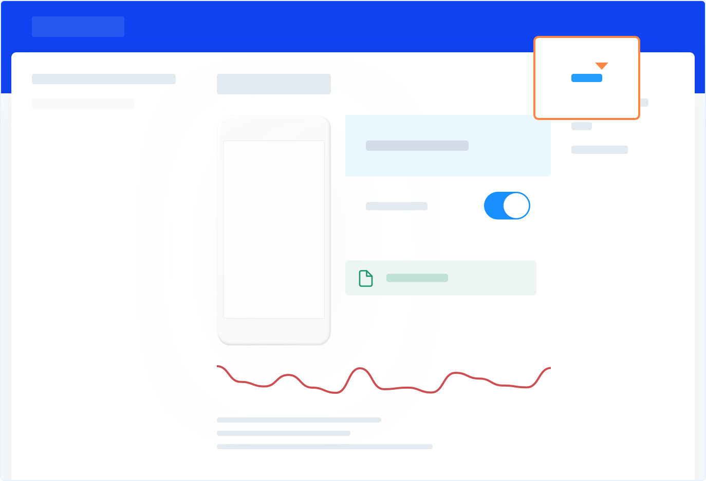

---
id: react-native-activity
title: Activity history
---
Shake diligently tracks user's interaction with your app, their network traffic and system events, and automatically attaches all of those to every bug report.

## Introduction
You can inspect all events that lead to a bug being reported. A link to Activity history is located in the top right corner:



## Android
### User actions
User actions are tracked automatically and require no additional setup.

### Network requests
If you want to see a user's network traffic, add the following import and enable the network tracker: 

App.js
```javascript {3,7}
import React, {Component} from 'react';
import {Text, View} from 'react-native';
import {NetworkTracker} from '@shakebugs/react-native-shake';

export default class App extends Component<{}> {
  componentDidMount() {
    NetworkTracker.enable();
  }
  
  render () {
    return (
      <View>
        <Text>Welcome!</Text>
      </View>
    );
  }
}
```

### System events
System events are tracked automatically and require no additional setup.

## iOS
### User actions
User actions are tracked automatically and require no additional setup.

### Network requests
Network requests are tracked automatically and require no additional setup.

### System events
System events are tracked automatically and require no additional setup.

:::important
In a Free workspace, you can see up to 20 events that lead to every bug. If you need to dive really deep to find causes of the weirdest bugs upgrade to Premium. In a Premium workspace you can browse the entire activity history.
:::

