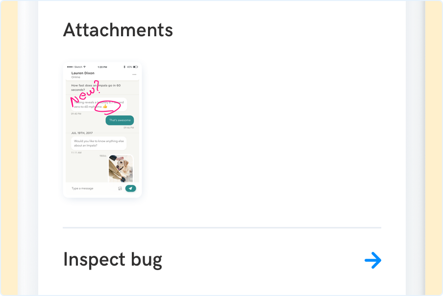

---
id: inspect
title: Inspect
---
The Inspect bug screen allows users to see the details of a bug from their device without reporting it.

Your users can inspect a bug — see its [Essentials](react/essentials.md) and [Metadata](react/quick-facts.md) — before submitting it. The Inspect bug screen is part of the SDK Wrap-up screen:

